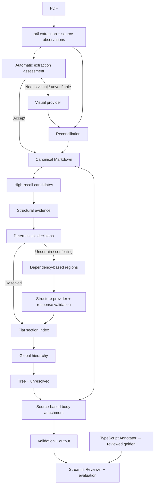

# Policy Parser — Executable Skeleton and Incremental Improvement Plan

Version: 1.1 · 2026-10-07

## Track A update: AI-assisted annotation bootstrap

Tonight no manual annotation review is required. Continue A0–A5 without reviewed
golden. For this repository select ONLY the first six original pages of EVERY PDF
in `test_docs` (four small slices); this replaces the earlier 2–3 sample request.
Use GPT only if credentials and a usable integration exist. Prefer original page
images with extracted text. Preserve labels, hierarchy, source order and own text;
never summarize or invent missing content. Save the unchanged annotator tree as
`silver.json`, with separate metadata: `annotation_status: ai_unreviewed`, PDF
SHA-256, original selected pages, actual model and generation method. Save uncertainty
notes separately. Validate schema, IDs, depths and basic text consistency; these
checks are not human review.

Reviewer comparisons must say “against AI draft reference”, never verified parser
accuracy. Reference generation/import is separate from inference; no parser stage
reads silver/golden. Resolver replay responses are synthetic and distinct from
evaluation references. If GPT is unavailable, build with synthetic fixtures and
prepare external-generation/import packets; never fabricate a successful call.
Later correct silver in the annotator against the PDF and explicitly download
reviewed `golden.json`, preserving original silver and its metadata. Stop at A5.

## Central implementation and verification checklist

- [x] A0: strict schema loader, first-six-page packets, silver import and annotator review declaration; corresponding UI/import checks.
- [x] A1: real p4l extraction, deterministic candidates, provisional tree, all Reviewer tabs and explicit rerun; UI smoke.
- [x] A2: automatic page assessment, unavailable/replay recovery, conservative reconciliation and revision invalidation; UI/tests.
- [x] A3: observations/decisions, cross-page dependency regions, atomic replay validation; UI/tests.
- [x] A4: global hierarchy, own-text/source accounting, conservative reference comparisons and exports; UI/tests.
- [x] A5: no-API/replay tests, real-PDF smoke, Streamlit checks, annotator check and review packet.

These mark the runnable skeleton checkpoints, not all advanced behaviors in the
original plan. Native-browser visual checks, live GPT generation, reviewed accuracy,
confirmed noise removal and enclosing body-scope resumption remain unavailable or
explicitly simplified. See the review packet for the evidence and limits.

Detailed limitations and any unverified checkpoints are recorded in `REVIEW_PACKET.md`.

### Architecture correction after delivery

The initial implementation compressed several responsibilities and the completion
claim was too broad. Stage implementation is now separated into every module named
in section 3 (`policy_parser/` is the actual package directory). `pipeline.py` only
orchestrates. Shared TypedDict contracts are in `models.py`; observation extraction
is separate from resolver decisions. Reference comparisons live in `evaluation.py`
and never feed inference. This refactor preserves the existing limited resolver;
it does not establish the useful real-PDF structure baseline originally intended.
Those initial gaps were addressed in the subsequent authorized no-API pass below.

### Authorized follow-up: remaining non-LLM baseline work

Proceed one component at a time with tests; keep live model calls unavailable.

- [x] Labels/candidates: contextual Roman/alphabetic alternatives, tight Markdown
  block separation, wrapped bold titles and source spans; isolated `(i)` remains ambiguous.
- [x] Evidence/resolver: sequence corroboration, repeated-heading/prose observations,
  separate role/parent uncertainty, local ancestor blocking, numeric scope conflicts;
  first-six-page M-24-08 now has I/II/III with A/B/C under III.
- [x] Regions/providers: deterministic grouping, section-only anchors, compressed
  outline; valid/rejected/abstaining synthetic replay and unavailable live transport.
- [x] Hierarchy/body/validation: cycle quarantine, source revision/offset/text/own-text
  checks, localized outstanding ownership, extraction failure and unresolved recovery.
- [x] Evaluation: confirmed repeated-title alignment; confirmed extraction/candidate/
  resolver miss attribution, explicit generator denominator, guarded own-text checks.
- [x] Reviewer/integration: outline rendering and unresolved drilldown in Tree;
  stage timings, real-PDF Streamlit check and no-API corpus accounting smoke.

Unimplemented advanced behavior remains explicit: live acquisition/resolution,
reviewed benchmark calibration, general mixed label grammars, exhaustive dependency
discovery, automatic document-title inference and enclosing body scope resumption
without a confirmed boundary. These are not concealed as successful stages.

### Next checkpoint: generalized dependency-region inputs

- [x] Group only explicit unresolved dependencies; adjacent unrelated candidates stay separate.
- [x] Merge overlapping page-local excerpts without changing source text or dropping candidate spans.
- [x] Select relevant anchors and their confirmed ancestor chains; following anchors are context-only.
- [x] Measure compact JSON character budget including document/revision envelope; expose the resource limit in Reviewer.
- [x] Skip oversized connected components before any provider request; retain the full unresolved component and record why splitting is unsafe.
- [x] Test arbitrary labels/wording, shared unknown ancestors across pages, local context, exact budget boundaries and UI skip behavior.

No PDF-specific dictionaries, profiles, headings or title words were introduced.
Safe internal splitting of a truly connected component is deferred until explicit
dependency-boundary information exists; preserving it is preferable to hiding an edge.

### Next checkpoint: generalized body scope and provenance

- [x] Record scope paths and heading-driven opening/closure events from accepted hierarchy relationships.
- [x] Keep cross-page source fragments exact; record minimal page-joining whitespace separately.
- [x] Preserve multi-page heading ranges without assigning continuation fragments as own body.
- [x] Treat unselected-page gaps as uncertain continuations until a supported heading establishes scope.
- [x] Preserve Markdown tables/code as body syntax; keep own text separate from descendants.
- [x] Add per-node own/heading source ranges, character accounting and an inspectable/exportable Body view.
- [x] Validate generated separators, exact fragments, own text and provisional ownership; test title substitutions, nested/sibling scopes, gaps and tables.

This does not guess unheaded ancestor resumption. Without source-supported closure
evidence, the active section continues and that assumption is explicit in each
span. No title keywords, policy names or per-PDF exceptions were introduced.

## 0. Instructions to the coding agent

Build a new Python parser from scratch in the existing repository. The repository already contains a TypeScript Document Outline Annotator. Inspect its location, package scripts, schema, and any applicable AGENTS.md before changing files. Preserve it; do not assume its framework or relocate it unnecessarily.

The immediate assignment is Track A: a complete, runnable, deliberately small vertical slice with a Streamlit Reviewer. All pipeline stages must be inspectable tonight, but advanced algorithms can be simplified and have explicit TODOs. Qwen and the structure LLM have no API credentials: implement unavailable and fixture-replay providers. Do not invent model results or require credentials to start the app.

Proceed continuously through A0–A5 without asking for approval at every step. Leave each checkpoint runnable and report progress. Stop after A5 and deliver the review packet. Track B is the subsequent roadmap, not permission to implement all advanced features tonight.

Human annotation is the user's work. Build its workflow first, but continue independent skeleton development if reviewed golden files do not yet exist. Label generated demos as synthetic; never claim they establish real-PDF accuracy. Do not overwrite user annotations.

## 1. Goal and non-negotiable boundaries

- Final behavior is automatic: p4l extraction, quality assessment, selective visual recovery, structure resolution, hierarchy, body attachment, validation. Manual overrides are debugging tools.
- Existing TypeScript UI creates golden trees. Streamlit inspects parser stages and compares predictions with golden files. JSON files connect them initially.
- Extraction owns source text. Structure resolvers select existing candidate IDs and relationships; they never generate titles or body text.
- Candidates optimize recall, with bounded, observable false positives. Recall is measured against human golden, never inferred from candidate count.
- Page is an extraction boundary, not a semantic boundary. Sections and ambiguous regions can cross pages.
- Ambiguity means unsupported, conflicting, or multiple plausible interpretations. No giant confidence score or user-tuned confidence threshold.
- Prefer ordinary functions, small dataclasses, sequential orchestration, and a single run-result object. No plugin registry, generic artifact/event framework, FastAPI, Kafka, or production infrastructure tonight.
- No document-specific heading dictionaries, per-document profiles, or language-specific keyword accumulation. Keep unavoidable parsing grammars and algorithm constants local and documented.
- Preserve unresolved states. A best-effort tree is not automatically a fully validated final tree.

## 2. Architecture



Every stage returns inspectable data, including status and reasons when skipped, unavailable, simplified, or failed. Streamlit renders these same outputs; UI must not contain a separate parser implementation.

## 3. Repository shape

Adapt names to existing conventions; this is a boundary guide, not a mandate to create empty abstractions.

```text
existing-typescript-annotator/  # preserve actual existing location
app.py                        # Streamlit entry point
parser/
  models.py                   # minimal shared values
  pipeline.py                 # sequential orchestration
  extraction.py               # p4l, page rendering, canonical assembly
  routing.py                  # assessment and visual-recovery selection
  reconciliation.py           # proposal comparison and selection
  candidates.py
  labels.py
  evidence.py
  resolver.py                 # deterministic + provider decision application
  regions.py
  providers.py                # unavailable / replay; live integration later
  hierarchy.py
  body.py
  validation.py
  evaluation.py
benchmarks/
  README.md                   # annotation and benchmark conventions
  <sample_id>/
    source.pdf
    golden.json
    metadata.json
    alignment.json            # optional source mapping; needed for reliable attribution
fixtures/                     # synthetic inputs and provider responses
tests/                        # focused invariant and integration checks
runs/                         # generated debug outputs; ignore in git by default
README.md
PLAN.md
```

Do not commit private PDF corpora by default. Keep fixture data small and reproducible. Inspect available dependencies and actual package APIs, lock the working versions, and document commands that work from repository root.

## 4. Minimal contracts

Use dataclasses or similarly small typed structures. These are field requirements, not a demand for a class hierarchy.

| Value | Minimum contents |
|---|---|
| PageExtraction | document hash, original 1-based page, raw Markdown, source engine, available text/layout observations |
| SourceRange | canonical revision, page, half-open page-local offsets; a list of ranges for cross-page content |
| ExtractionAssessment | ACCEPT / NEEDS_VISUAL / UNVERIFIABLE, reason codes, supporting observations, check availability |
| RepairProposal | original/proposed page outputs, provider mode, reconciliation differences, adoption status |
| Candidate | ID, original text, source range(s), parsed title/label, Markdown level, signals |
| Evidence | observed structure signals, possible role/parent interpretations, support/conflict reasons |
| Decision | candidate ID, role, parent ID if known, RESOLVED / AMBIGUOUS, reasons, origin |
| Region | candidate IDs, unresolved dependencies, anchors/ancestor context, source excerpts, budget status |
| Section index | accepted sections and relationship decisions, separate unresolved records |
| RunResult | all stage outputs, provider modes, limitations, timings, output tree, validation and evaluation |

Candidate IDs must be deterministic within the same document + canonical revision and must not depend on golden IDs. Root parent and unknown parent must be distinct values. Re-extraction changes the canonical revision: invalidate old offsets, decisions, alignments tied to that revision, and replay results unless explicitly revalidated.

Keep algorithm observations separate from decisions. Status RESOLVED is a system decision, not a correctness measurement.

## 5. Golden data contract

Read/write the annotator's existing public schema unchanged:

```json
{
  "root": {
    "id": "root",
    "label": "",
    "title": "Document Title",
    "text": "Preamble",
    "depth": 0,
    "children": [
      {
        "id": "stable-human-node-id",
        "label": "1",
        "title": "Scope",
        "text": "Own body text only",
        "depth": 1,
        "children": []
      }
    ]
  }
}
```

Annotation conventions:

- `text` contains own text, excluding child text. Tree traversal must not duplicate child bodies into parents.
- `children` preserve semantic/source order; `depth` is derived from parentage.
- Keep original labels; do not automatically renumber after moving nodes.
- Root holds the document title and preamble. Exclude root from section-heading metrics by default.
- Treat numbered clauses as nodes when they delimit independently addressable content; inline enumerations remain body. Annotate uncertain cases in metadata.
- Exclude running headers, footers and TOC entries from section-heading targets; retain substantive content. Record difficult exceptions rather than silently changing policy.
- Tables remain faithful Markdown in own text for the first version. Unheaded continuation text stays with its section across pages.
- Golden IDs are editing identities; evaluation must not require identical prediction IDs.
- Root title/body should have a separate diff rather than enter candidate-heading recall.
- Manually verify golden against original PDF. Parser-generated seeds are unreviewed until checked.

`metadata.json`: sample ID, source SHA-256, original page selection, annotation status (`pending_external_generation`, `ai_unreviewed`, `unreviewed`, `reviewed`, `synthetic`), actual model, generation method and notes. Long-document slices must retain original page numbers and define their artificial-root/context convention. Keep silver metadata separate from reviewed golden metadata.

`alignment.json`: golden node ID → original page(s), original heading text, and optional precise source location. Repeated titles and multiline headings require human confirmation. Golden-to-PDF links survive canonical changes; golden-to-Markdown offsets must carry the canonical revision.

## 6. Track A — Tonight's runnable skeleton

### A0 — Inspect repository and establish golden workflow

Implement:

1. Inspect annotator schema and run scripts; document its existing startup command.
2. Add benchmark conventions and golden schema/depth/ID validation.
3. Add a Streamlit benchmark loader: PDF + optional golden + optional alignment, with annotation status visible.
4. Add original-page rendering so user can consult the PDF while annotating/reviewing.
5. Provide synthetic demo source/tree and an in-memory synthetic PDF extraction fixture, clearly labeled synthetic. Prepare first-six-page image/text packets for every PDF in test_docs. Import external AI drafts if no GPT integration exists; manual review is deferred.

UI checkpoint: upload a PDF and golden JSON, see document metadata and schema problems; existing annotator still starts. Invalid golden must not crash or silently normalize into a misleading score.

Exit: golden workflow usable; missing human annotations do not block A1–A5.

### A1 — Real baseline and reviewer shell

Implement p4l extraction with per-page output, conservative canonical assembly, candidate extraction, a simple deterministic tree, basic source slicing and JSON export. Add the remaining tabs now with explicit `not yet implemented` statuses, then replace each during A2–A4.

UI tabs: Source, Markdown, Extraction/Router, Candidates, Evidence, Regions, Decisions, Tree, Body, Quality, Evaluation. Store current run in Streamlit session state so normal UI interaction does not repeatedly extract the PDF. Add explicit Run/Re-run actions.

Candidate baseline: Markdown headings, numbered title-like blocks, standalone bold/underline, short uppercase blocks, and short isolated plain blocks. Operate on Markdown blocks, not every visual line. Deduplicate identical source spans while retaining all signals. Include a minimal multiline-title example. Do not classify all candidates as sections.

Label baseline: dot-separated digits and basic parenthesized components; unsupported/ambiguous forms preserve raw text. Alphabetic/Roman ambiguity such as `(i)` must not be guessed from the token alone.

UI checkpoint: one uploaded real PDF runs without model credentials; Markdown, candidates, provisional tree/body and JSON can be inspected.

### A2 — Automatic extraction routing and dummy visual recovery

Implement an automatic assessment for every page before candidate generation. Use a small number of generic mechanisms:

- Text-layer availability and broad coverage disagreement between source text and extraction.
- Reading-order risk from text-block arrangement, where reliable observations are available.
- Structural preservation risk for tables/layout, where checkable; otherwise mark the check unavailable.

Do not pretend geometry proves a defect or p4l is ground truth. ACCEPT means no issue found by the available checks; it is not a guarantee. Inadequate evidence yields UNVERIFIABLE. Define deterministic reason codes and avoid a weighted score or configuration matrix.

For NEEDS_VISUAL / UNVERIFIABLE, the pipeline automatically requests visual recovery. Render only selected pages for provider input when necessary. Use unavailable provider by default, or explicit fixture replay keyed to document hash, page and input revision. No network credentials required.

Reconciliation baseline: retain both outputs, compare normalized text occurrence counts plus important tokens, display omissions/additions/repetition/order changes. Reordering must not be treated as content loss. Preserve negations and ordinary text, not only numbers. A generic comparison cannot reliably resolve every disagreement; conservatively retain original and flag uncertain proposals. A fixture demonstrating verified order-only recovery may be adopted. Synthetic/replay provenance stays visible.

Manual Request repair and Accept proposal are debug overrides, stored separately from automatic decisions. Changes trigger downstream rebuilding and decision invalidation. Automatic adoption must use the same reconciliation path, not bypass it.

UI checkpoint: every page shows assessment, evidence, requested action, provider result and adopted source. An unavailable recovery preserves p4l with an explicit warning. Demonstrate replay on a synthetic example and show revisions changing.

### A3 — Evidence, ambiguity, regions and dummy structure resolver

Implement observations → candidate decisions. Resolve only strongly supported role/parent relationships, including simple consistent Markdown/numbering examples. Formatting alone does not prove a heading. Keep role uncertainty separate from parent uncertainty.

Never interpret "only one parent left" as proof that a candidate is a section. If an earlier unknown candidate could be its parent, do not resolve merely because it was omitted from the accepted tree.

Use reasons such as ROLE_UNCERTAIN, PARENT_UNCERTAIN, EVIDENCE_CONFLICT and SEQUENCE_ANOMALY. No confidence threshold. Keep possible-parent hypotheses bounded; do not enumerate complete trees.

Build regions from explicit unresolved dependencies, such as shared uncertain ancestor or interacting parent alternatives. Tonight a simple graph component/grouping implementation is enough. Include cross-page cases. Attach minimum local source context and confirmed anchors. Adjacent ambiguities may share context but are not necessarily one dependency group. Missing dependency discovery is an explicit limitation; do not claim the baseline finds every interaction.

Structure provider input: candidate IDs, local Markdown, evidence, allowable external anchor IDs, compressed outline. Output: role/parent decisions only. Provider may abstain. Validate unknown IDs, duplicates, missing decisions, inadmissible parents and cycles before application. Missing outputs remain unresolved. Conflicting batches must be rejected or quarantined, not partially applied in arbitrary order.

Unavailable provider preserves ambiguities; replay fixtures exercise valid and invalid responses. A replay decision is not a human override and not model-quality evidence.

UI checkpoint: inspect the dependency/grouping reason, region context, input payload, response validation and decision origin. Show a cross-page region, an unresolved region without API, a valid replay, and a rejected replay.

### A4 — Global hierarchy, own text, validation and evaluation

Global hierarchy merges accepted decisions, checks parent existence/cycles/order consistency and preserves unresolved records. It must not force all unknown nodes to root and count them as resolved. Compressed-index LLM support is a documented extension point, not a second implemented model architecture tonight.

Body baseline: walk accepted heading boundaries in canonical source order; assign intervening source spans to the active section, with root owning preamble. An intervening rejected candidate stays body text. Parent own text ends when a child starts and may resume after a confirmed enclosing scope closes. Do not simply assign text until the next sibling; that duplicates descendants.

Represent uncertain intervals explicitly when ambiguous candidate boundaries could change ownership. A provisional assignment may be displayed/exported with status and source ranges, but must not be reported as verified body accuracy. Preserve cross-page source ranges and tables; no rewritten text.

Validation: valid tree, unique IDs, valid parents/depths, cycles, source spans, duplicate assignment, uncovered canonical text, text conservation and pending ambiguity. Accounting uses ASSIGNED / NOISE / IGNORED_WITH_REASON; unsettled spans remain outstanding, not NOISE. Tonight do not remove running headers/footers by unverified guesses.

Evaluation:

- One-to-one heading matching using source alignment when available; otherwise label/title/source order with manual confirmation for uncertain matches. Report uncertain alignment separately.
- End-to-end candidate recall = golden headings captured / eligible golden headings.
- Generator recall = captured / golden headings confirmed present in Markdown. If extraction presence is not confirmed, show N/A rather than inventing this denominator.
- Candidate precision and final section precision/recall use confirmed matches; display counts and coverage.
- Parent accuracy compares mapped parents for matched sections; report its denominator and missing-section rate separately.
- Report ambiguity by role, parent, region count and size. Candidate-level ambiguity is not automatically percent of document text.
- Categorize confirmed misses as extraction, candidate generation, or resolver failures. Otherwise show unclassified.
- Show body diffs first. Exact/normalized own-text checks only when alignment and ownership are reliable. Whitespace normalization must not erase substantive changes.
- Never score reviewed golden data, synthetic fixtures and replay-assisted outputs as one production metric.

UI checkpoint: click a missed/extra/misparented heading to see golden, PDF, Markdown, candidates and decisions. Export prediction JSON in annotator schema plus a separate debug/evaluation report. Incomplete results must remain clearly labeled.

### A5 — Integration checks and delivery

Focused tests must cover: existing golden schema, same-input deterministic candidates, source spans, numbering/Markdown conflict, uncertain role, cross-page region, provider unavailable, replay fingerprint mismatch, invalid provider IDs/cycles, body nonduplication and evaluation with repeated titles.

Run one end-to-end no-API smoke test and one replay integration test. Start Streamlit and verify the relevant UI workflows using available browser testing or Streamlit testing; document anything not visually exercised. Verify the annotator using its existing build/start checks when dependencies permit.

Every parser module and `app.py` must include a short header:

```python
"""
Current: implemented behavior.
Limitations: explicit simplifications and unsupported cases.
TODO(Bx): concrete next improvement linked to Track B.
Acceptance: fixture/benchmark/UI evidence needed to verify it.
"""
```

Maintain one central checklist in PLAN.md. Only mark tasks done when the implementation and corresponding UI check exist. Do not hide stub behavior behind successful-looking empty tables.

Deliver:

1. Exact verified setup/start/test commands for Python Reviewer and existing annotator.
2. Implemented/simplified/unavailable matrix for every stage.
3. Sample status: reviewed human, unreviewed, synthetic; real measured results only where available.
4. No-API and replay results, known failure examples, and next recommended Track B component.
5. Approximate component size and the test/check results.

STOP after A5. Tonight is complete when the user can annotate a PDF, run the parser without API, inspect every stage and compare with golden. It is not a claim of final parser accuracy.

## 7. Track B — Subsequent debugging and improvement

All phases retain the complete Reviewer. Implement → benchmark → inspect UI → compare baseline → KEEP / REVISE / DELETE → report. Stop at each B-phase checkpoint for user review; do not automatically implement the entire roadmap.

| Phase | Work | Required UI evidence and exit gate |
|---|---|---|
| B1 Golden/measurement | Create 2–3 reviewed samples first, then broaden to roughly 8–12 representative documents/slices. Add source alignment; reserve unseen samples. | Reliable missed-heading attribution and matching; no guessed denominators. Freeze/version baseline before tuning. |
| B2 Extraction/router | Validate generic coverage, order and structure checks against actual page defects. Calibrate a few internal defaults rather than add document profiles. | Page decision evidence, false repair requests, missed defects, extraction completeness and downstream impact. Checks unavailable must remain visible. |
| B3 Qwen/reconciliation | Add live provider when credentials exist; conservative text-preserving order/table recovery and scan fallback. | p4l vs hybrid on the same samples: heading/tree impact, ordinary-text and important-token fidelity, latency and recovery call count. No improvement claim from replay. |
| B4 Candidates/labels | Improve general block segmentation, multiline headings, isolated plain headings and context-dependent labels. | Per-type recall, precision, candidates/page, examples of misses, performance on held-out samples. Do not chase aggregate recall with unlimited candidates. |
| B5 Evidence/deterministic resolver | Improve bounded role/parent alternatives and constraint propagation; account for unresolved intervening ancestors. | Correctness of resolved decisions vs golden, remaining ambiguity, conflicts. Raising resolved rate alone is not success. |
| B6 Regions | Refine dependency discovery, anchors, cross-page context and splitting under provider budgets. | Why each region exists, missing dependencies, median/max size, candidate and source coverage. Oversized regions remain flagged rather than silently truncated. |
| B7 Live structure resolver | Add a real provider under the existing interface. Local region resolution with explicit abstention and atomic validation. | Deterministic vs live results, role/parent improvement, failures, calls/tokens/time. Prompts cannot access golden during inference. |
| B8 Global ambiguity, conditional | First improve deterministic global consistency. Only implement overlapping windows/map-reduce if region and benchmark measurements justify it. | Shared IDs, duplicate/conflict handling, cross-window parents, context completeness and comparison to simpler baseline. Do not build it solely for hypothetical long PDFs. |
| B9 Body/content accounting | Improve scope closure, inline headings, continuation text, tables and provenance; add confirmed noise handling. | Own-text fidelity, duplication/loss, uncertain ownership, accounting completeness and body diffs. Structural errors remain distinguishable from slicing errors. |
| B10 Long-document efficiency | Measure real long PDFs; bounded selective calls, memory and page processing. Add caching/concurrency only after observed need. | Peak memory, total/runtime by stage, recovery rate, tokens/cost with actual providers. Same accuracy checks still pass. |
| B11 Integration | Integrate Reviewer/annotator if useful, then production adapters/API/service concerns as explicitly needed. | Reviewed component quality and stable exports before adding deployment infrastructure. |

No universal accuracy target is invented in advance. Establish observed baseline and acceptable errors with the user. Absolute gates throughout: no silent text loss, fabricated model success, unknown-ID acceptance, invalid hierarchy, or mislabeled accuracy metrics.

## 8. Automatic routing and ambiguity design constraints

### Router

Assess extraction adequacy, not semantic document category. Multi-column layout is risk evidence, not an unconditional Qwen trigger. Weak text-layer availability, conflicting reading-order evidence and lost structure are reusable concerns. When a check cannot be made, expose that fact.

Route at page granularity initially. Record intended route separately from executed route when provider is unavailable. Later budget exhaustion is also an explicit fallback reason. Permit at most a bounded recovery attempt per page in the baseline; no recursive retry loops.

A scan has no reliable p4l textual authority. Live scan output must be labeled visual acquisition; reconciliation must not wrongly reject all its text because it differs from an empty text layer.

### Ambiguity

Separate uncertain role, uncertain parent and conflicting evidence. Keep alternative relationships with their evidence; unknown alternatives are not resolved by deleting them. Confirmed anchors are context, not absolute cut points if dependencies cross them.

"Unique interpretation" refers to the available modeled evidence and assumptions, not mathematical proof of the author's intent. Measure false confident decisions against golden. A small transparent resolver is preferable to exhaustive constraint solving tonight.

### Configuration

User-facing settings: provider availability/mode, connection details, input/output paths, model input/resource budgets. Debug-only selection/overrides must be labeled. No exposed grid of heading weights, ambiguity thresholds, router presets or per-PDF rules. Document the few necessary internal constants and revisit them only from measured failures.

## 9. Final agent handoff

Start by inspecting the existing TypeScript annotator, then execute Track A. Keep the project usable after each step. Use real p4l extraction and transparent minimal implementations for all stages. Make automatic router decisions without credentials; unavailable providers must preserve uncertainty. Build the golden workflow before tuning any algorithms. Include concrete TODOs in every new parser script, and return the A5 review packet before advanced Track B work.
## Automatic/manual whole-run debugging checkpoint

Implemented preserved automatic baselines, explicit Markdown override rebuilds,
whole-run comparison downloads, and Reviewer switching between both outputs.
Comparison runs after inference and includes changed pages, hierarchy/own-text
differences, unresolved decisions and validation. Matching across canonical revisions
is provisional and excludes repeated/renamed identities. No verified parser accuracy
or human annotation review is claimed. Live calls remain unavailable; candidate
role/parent editing is not part of this checkpoint.
## Repeated margins and heading footnotes repair

General source-edge repetition across three pages now supplies non-section
evidence without deleting text or suppressing explicit/bold/numbered headings.
Trailing superscript footnotes are excluded from label parsing while source spans
remain intact. The nonprofit six-page regression now assigns A, B and C to II
with separate own text. Interior repetition and two-page repetition do not trigger
the margin rule. This remains a provisional structural assumption, not noise review.
## Single alphabetic children and plain numeric sequences

First alphabetic headings can be supported by established Roman context and
following prose, without inventing a sibling. Resolver acceptance requires the
context parent to remain active, and intervening uncertain boundaries still block.
Plain numeric headings support bare/dot/closing-parenthesis/parenthesized labels,
with a restart at 1 under active alphabetic sections. Existing dotted-path and
Markdown-conflict safeguards remain. No document-specific wording or API calls.
